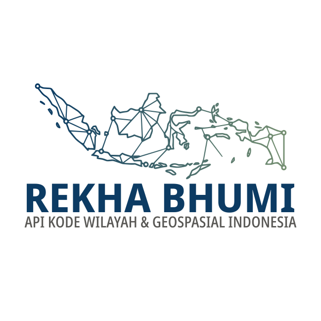

## Tokenize Rekha Bhumi Nusantara

*Tokenize* ini digunakan untuk mendaftarkan web yang akan menggunakan API Rekha Bhumi Nusantara dan akan mendapatkan token atau API *key* yang harus dipasang di dalam aplikasi sebagai verifikasi penggunaan.

## Mengapa Perlu Mendaftarkan?

Karena secara mendasar, sebagai administrator jaringan dan aplikasi pasti memerlukan kepastian siapa yang mengakses, berapa kali mengakses, apakah yang diakses sukses atau gagal, seberapa cepat layanan akses dapat diberikan? Semua ini hanya dapat diberikan bila administrator mengetahui siapa yang melakukan akses.